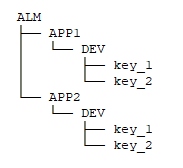
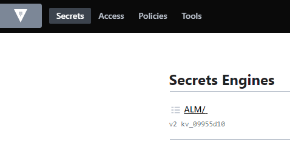
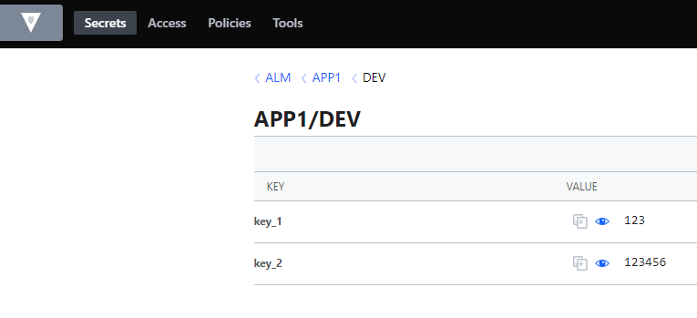
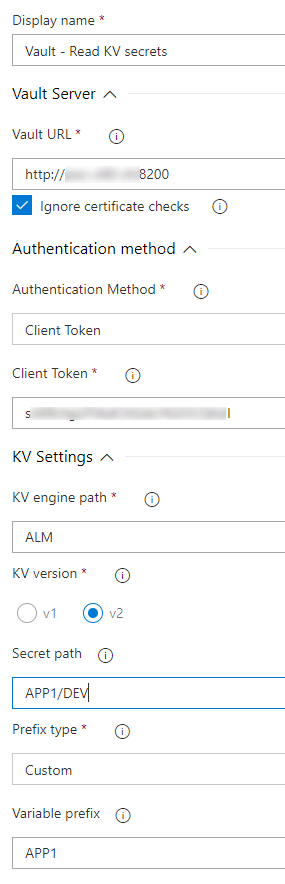
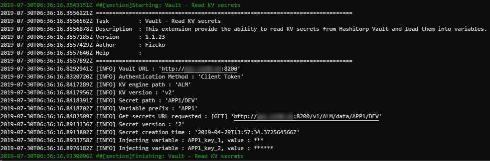
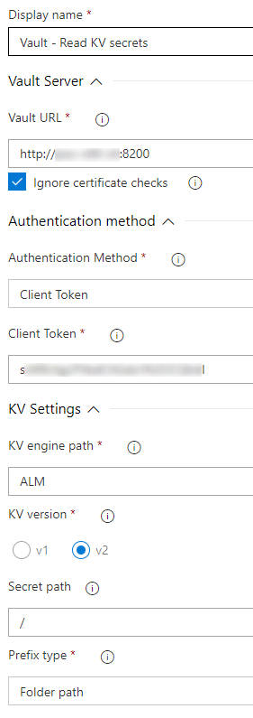
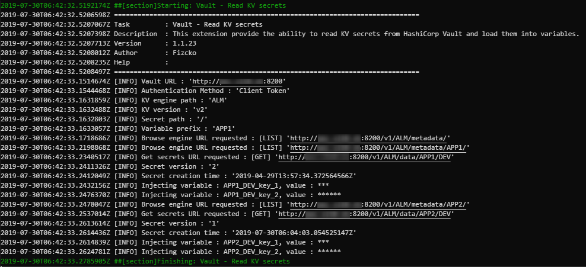
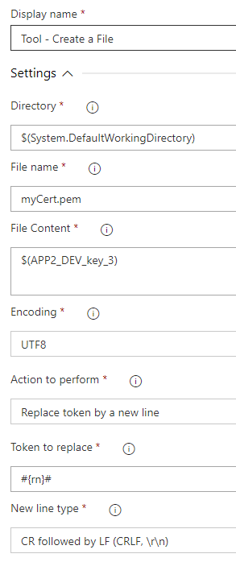
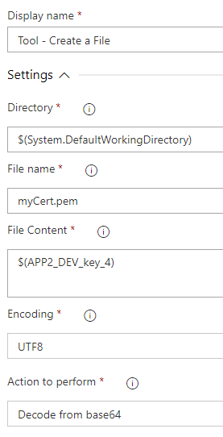

## Vault Interaction
  This extension provide the ability to interact with [HashiCorp Vault](https://www.vaultproject.io/ "HashiCorp Vault's Homepage").

## Authentication methods available

  - AppRole
  - Azure
  - Client Token
  - LDAP
  - Radius
  - Username & Password

## Utilities

- ### Vault - Read KV secrets

  Provide the ability to read KV secrets from HashiCorp Vault and load them into variables.

  ## Note  

  The field « Secret path » have to ends with a « / » if you want to discover secrets across current folder and his subfolders.
  See [Use case 2](#Use-case-2).
  In discovery mode if the « Prefix type » is set to « None » or « Custom » and you have secrets with the same name in different folder the last value read will be set in the variable (erasing previus values).

  ## __Examples__

  For the examples the following folder structure is created.

  

  « ALM » is a KV v2 engine.

  

  « APP1 » and « APP2 » is two folders containing a subfolder « DEV » and two secret « key_1 » and « key_2 ».

  

  ## Use case 1
  
  Read secrets from a KV v2 engine called « ALM » located at path « APP1/DEV ».

  

  

  There is now two variables called « APP1_key_1 » and « APP1_key_2 » that you can used in your next tasks by using $(APP1_key_1) and/or $(APP1_key_2).

  ## Use case 2
  
  Read secrets from a KV v2 engine called « ALM » and browse recursively on sub folders.

  

  

  There is now four variables called « APP1_DEV_key_1 », « APP1_DEV_key_2 », « APP2_DEV_key_1 », « APP2_DEV_key_2 » that you can used in your next tasks by using $(APP1_DEV_key_1), $(APP1_DEV_key_2), $(APP2_DEV_key_1), $(APP2_DEV_key_2).

- ### Tool - Create a File

Provide the ability to create a file and perform an action on his content.

Parameters :
- **Target directory**: Directory to save the file.
- **File name**: Name of the file to create (ended by the extension).
- **File Content**: Content of the file.
- **Encoding**: Output file encoding. More defails in NodeJS documentation (Buffers and Character Encodings).
- **Action to perform**: Action to perform on the file content.
  - Replace token by a new line
  - Decode from base64
- **Token to replace**: Define the token to replace by a new line.
- **New line type**: The type of the new line.
  - Carriage Return (CR, \r)
  - Line Feed (LF, \n)
  - CR followed by LF (CRLF, \r\n)

  ## Use case 1

  A variable loaded by the task « Vault - Read KV secrets » contains a multiline value where the carriage return have been replaced by a token.
  This variable is named « $(APP2_DEV_key_3) ». The token is « #{rn}# ».

  

  A file called « myCert.pem » will be created and the token « #{rn}# » will be replaced by a Windows Carriage Return (CRLF).

  ## Use case 2

  A variable loaded by the task « Vault - Read KV secrets » contains a base64 encoded value.
  This variable is named « $(APP2_DEV_key_4) ».

  

  A file called « myCert.pem » will be created with the content of decoded from base64.

## Release note

### v2.5.0
- Add the task « Tool - Create a File ».

### v2.4.0
- Add possibility to use namespaces (Vault Enterprise).

### v2.3.1
- Fix Windows carriage return who were replaced twice.

### v2.3.0
- Add possibility to replace carriage return by a token in secrets having multilines because Azure Devops do not manage multiline secrets.

### v2.2.0
- Add possibility to set a timeout value when requesting Vault's API.

### v2.1.0
- Add possibility to change the path of an authentication method.

### v2.0.0
- The task now can recursively load secrets from a folders and his subfolders. Or just load secrets from a specific path.

### v1.1.0
- Add Azure authentication method
- Add Radius authentication method
- Improvement of the errors management

### v1.0.0
- Read secret from a KV engine (v1 or v2) and load them into variables.
